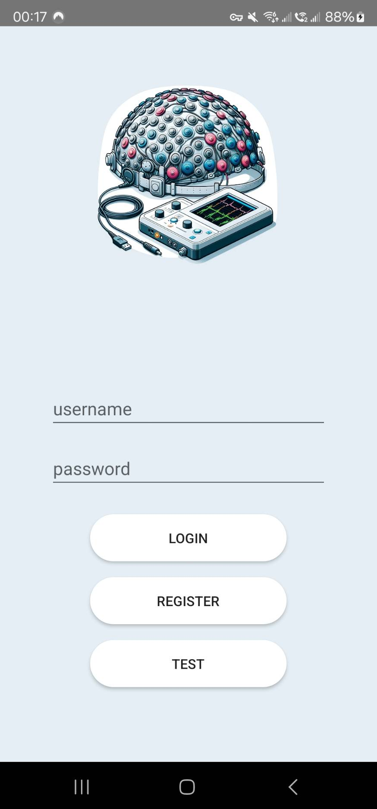
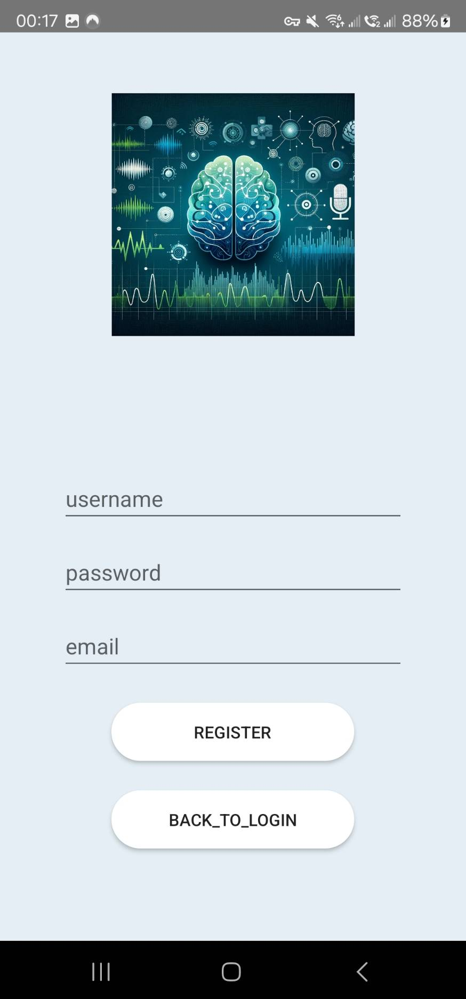
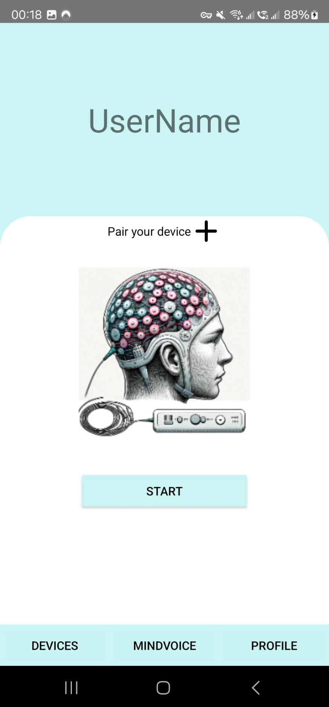
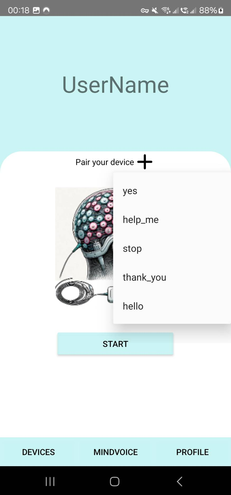
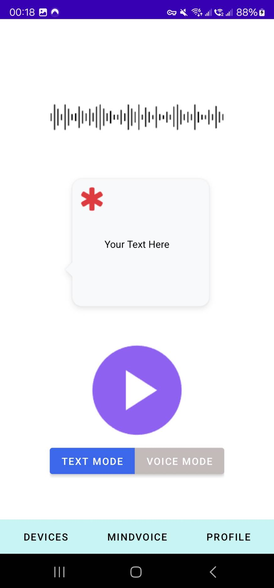
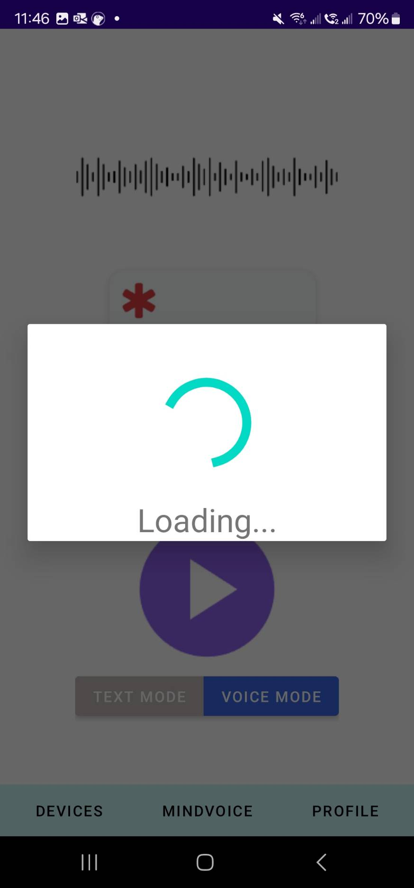
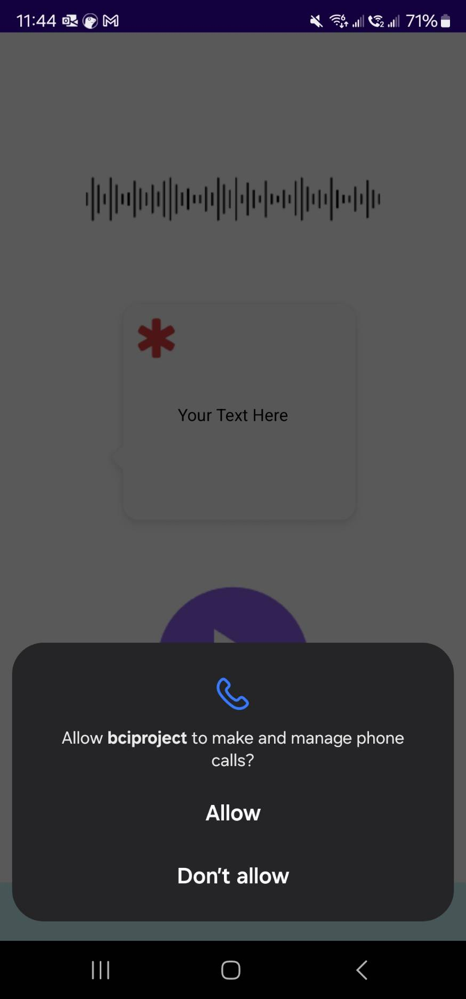
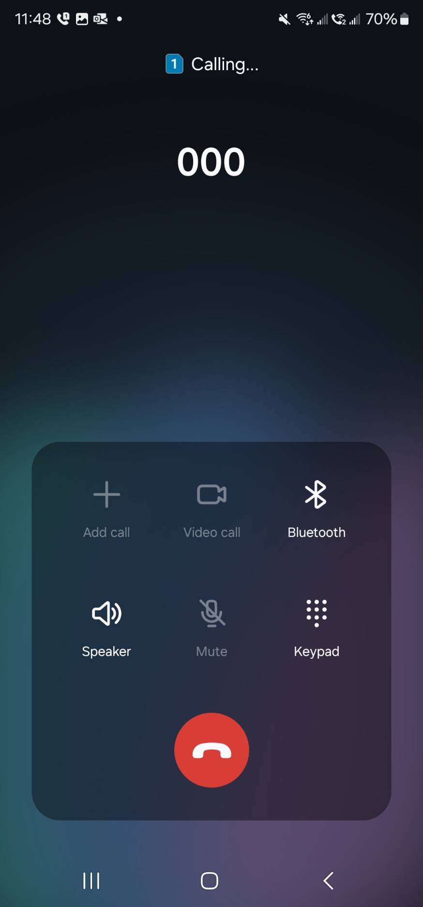

# SSW555-Agile-Duck
Team 11 SSW 555 Project for a Brain-Computer Interface

## User Manual
Upon launching the application, you will be directed to the Login Page.

### Login Page

For Returning Users:
    Username and Password: Enter your registered username and password in the provided fields.
    Login: After entering your credentials, press the “LOGIN” button to access your account.if you want to test the rest of functionalities without login, press the “TEST” button and it will direct you to the “DEVICES” page
For New Users:
    Register: If you do not have an account, press the “REGISTER” button. You will be redirected to the Registration Page where you can create a new account by providing the necessary information.
Exploring Without Logging In:
    Test the Application: If you wish to explore the app's functionalities without logging in, press the “TEST” button. This action will direct you to the Devices Page, where you can test the rest of the functionalities.

### Register Page
For New Users :
    Enter your desired username, password , and email address in the provided fields.
    After filling out all the fields, press the Register button to complete the registration process and create your new account.
For Returning Users:
    If you decide not to create a new account and wish to return to the login page, simply press the Back to Login button. This action will redirect you to the login page where you can sign in with your existing account credentials

### Devices Page
Pairing device:
    Accessing Available Devices by taping the cross icon (✕) located on the Devices Page. This action will bring up a dropdown menu displaying all available EEG devices that can be paired with your mobile device.
For Testing Purposes:
    The dropdown menu includes 5 test cases designed for testing purposes. Select any of these test cases by tapping on your choice.
    Press the Start button after selecting a test case. This will redirect you to the MINDVOICE page, where you can proceed with the specific test.
Navigating Between Pages:
    At the bottom of the Devices Page, you will find 3 buttons corresponding to different sections of the app. You can navigate between these pages by pressing the respective button for the page you wish to view.

### MindVoice Page
Get the classify result:
    Press the start icon, and send the test case to our back-end, and receive the result.
Switching between Text Mode and Voice Mode:
    You can choose the way to display the result by press on the text mode button or voice mode button.
Permission Request and Emergency call:
    The application requires permission to make and manage phone calls for the emergency call feature to function.
    If you grant this permission, and the prediction result is “help me”, the application will automatically initiate a phone call to a predetermined emergency contact.
Navigating Between Pages:
    At the bottom of the Devices Page, you will find 3 buttons corresponding to different sections of the app. You can navigate between these pages by pressing the respective button for the page you wish to view.

